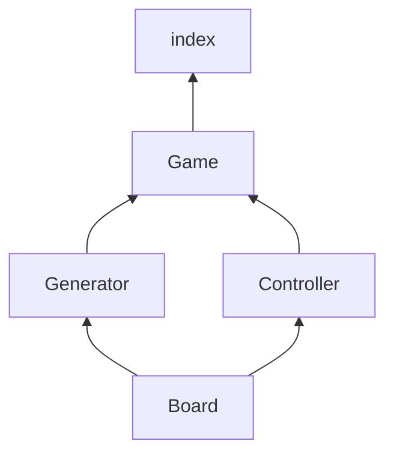

# How to init?
### 1. Run command `npm i`
### 2. Run command `node ./src/index.js`

# How to run tests ?
*Requirements:
- Nodejs version > 20
### Run command `node --test "**/*.test.js"`

# Module system
